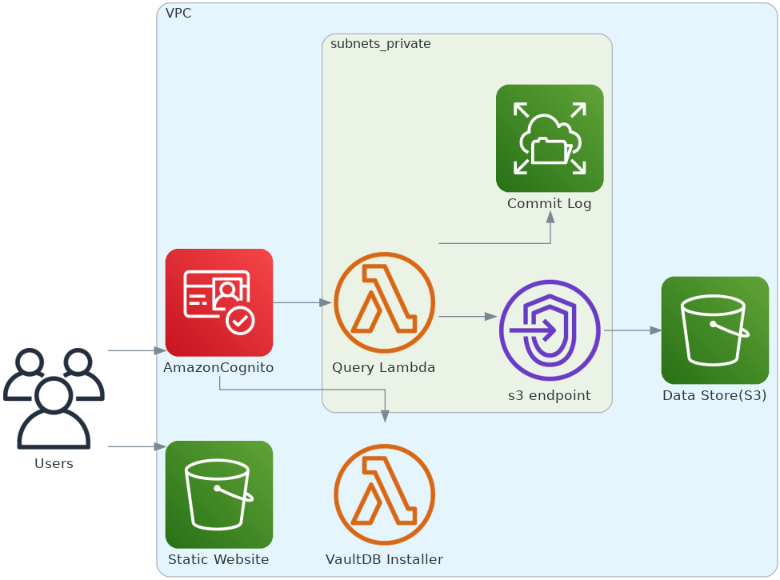

VaultDB Database Hub
=============================

This repository contains the VaultDB ai platform aws quickstart templates.

Architecture Diagram
--------------------

#### Componets created by the Cloudformation Templates

Cost
----

#### You Pay to AWS for the amount of Data storage and Lambda Compute you use. typical cost for my development and testing is close to **Zero**

Setup Environment
-----------------

### Create Service Role

#### AWS CLI Command to Create Service Role

    awsv2 cloudformation create-stack --stack-name vaultdb-service-role --template-body https://vaultdb-web.s3.us-east-2.amazonaws.com/awsquickstart/service-role.yaml --capabilities CAPABILITY_NAMED_IAM
        

#### Create VaultDB Instance using Service Role created above

#### AWS CLI Command to Create VaultDB Instance

    awsv2 cloudformation create-stack --stack-name [APPLICATION-STACK-NAME] --role-arn "arn:aws:iam::[AWS-ACCOUNT-NUMBER]:role/vaultdb_cloudformation_service_role" --template-url https://vaultdb-web.s3.us-east-2.amazonaws.com/awsquickstart/vaultdb.yaml --parameters ParameterKey="AdminEmail",ParameterValue="[APPLICATION-ADMIN-EMAIL-ADDRESS]" ParameterKey="PrimarySubnetAZ",ParameterValue="[AWS-REGION]" ParameterKey="ExistingVpcID",ParameterValue="[VPC-ID]" ParameterKey="PrivateSubnetCIDR",ParameterValue="[PRIVATE-SUBNET-CIDR]" ParameterKey="BucketName",ParameterValue="vaultdb-web" --capabilities CAPABILITY_NAMED_IAM CAPABILITY_AUTO_EXPAND
    
        Values you can use:-- 
            APPLICATION-STACK-NAME
                Pick a Uniquename for your installation and append test/dev/uat/prod etc to diffrentiate between different environments.
            AWS-ACCOUNT-NUMBER
                AWS Account number
            APPLICATION-ADMIN-EMAIL-ADDRESS
                this email will receive the user passwords and instructions on how to start using VAULTDB ai platform.
            AWS-REGION
                please enter the region in which you would like to deploy VaultDB at. eg. us-east-1a
            VPC-ID
                Provide the VPC ID if you have one and wants to use that otherwise remove the parameter all together or provide empty value
            PRIVATE-SUBNET-CIDR
                172.31.200.0/20
        

###### Delete/ Uninstall

awsv2 cloudformation delete-stack --stack-name \[APPLICATION-STACK-NAME\]

License
-------

All Images and Text copyright VaultDB.ai LLC